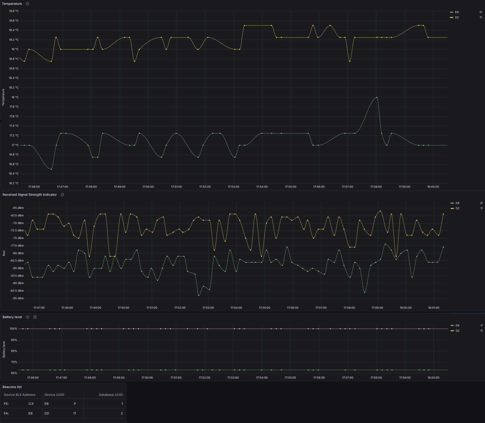
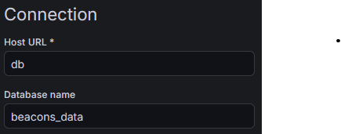

<div style="display: flex; align-items: center; gap: 15px; margin-bottom: 20px;  margin-top: 20px; ">
  
  <h1 style="margin: 0; ">Beacon Telemetry Hub</h1>
</div>

 


<!-- toc -->
## Contents
  * [📖Project Summary](#project-summary)
    * [Beacons Overview](#beacons-overview)
    * [Operating principle](#operating-principle)
    * [Features](#features)
    * [Containers](#containers)
    * [Deployment Environments](#deployment-environments)
    * [Screens](#screens)
  * [📚Architecture Overview](#architecture-overview)
  * [🛠️Development](#development)
  * [🚀Getting Started](#getting-started)
    * [Prerequisites](#prerequisites) 
    * [Deployment with Docker](#deployment-with-docker) 
    * [Deployment as a Windows Application](#deployment-as-a-windows-application)
    * [Configuration](#configuration)
    * [Setup Dashboard](#setup-dashboard)
  * [📝TODO List](#todo-list)
  * [📦Main Dependencies](#main-dependencies) 
  * [📄Licence](#licence)
  * [⚖Disclaimer](#legal)
    
<!-- endToc -->

---
## 📖Project Summary

The Beacon Telemetry Hub is a service for receiving, processing, storing, and visualizing data from
[Estimote®](https://estimote.com/) Proximity and Location Beacons using Bluetooth® Low Energy (BLE).

It is built on .NET 9, written in C#, and fully containerized with [Docker®](https://www.docker.com/),
providing a scalable setup for managing beacon telemetry data.

### Beacons Overview

A BLE beacon is a small, low-power transmitter that periodically broadcasts a unique identifier and,
optionally, sensor data such as temperature or atmospheric pressure.
Nearby devices (for example, smartphones or scanners) can receive this data without any pairing.

You can learn more about Estimote beacons [here](https://developer.estimote.com/how-beacons-work/).

### Operating principle

The main operating principle is to receive raw BLE [advertising](https://www.bluetooth.com/blog/bluetooth-low-energy-it-starts-with-advertising/)
packets using the BLE adapter (from all nearby devices), detect packets from Estimote devices 
(by checking that the service UUID matches the Estimote service UUID),
and parse the content of these packets (from Service Data) into the appropriate model (`BeaconTelemetryA`, `BeaconTelemetryB`, `BeaconTelemetryAExtended`, or `BeaconTelemetryBExtended`).

Next, these models are mapped to DTO models containing separated data such as temperature, battery level, etc., and sent to the data store (for example, saved to the database).

### Features

- Supports all types of Estimote telemetry [packets](https://developer.estimote.com/sensors/estimote-telemetry/)
(Subframes A and B) from both Location and Proximity Beacons.
- Full docker-compose integration to deploy and centralize all hub components with a single command.
- Supports multi-target data persistence, e.g. SQL databases, `.csv` file logging, and external API forwarders.
- Extensible architecture for adding custom data processing.

### Containers

This project includes a `docker-compose.yml` file to set up all components for a full-stack deployment. 
This ensures that the hub, database, and visualization tools work together seamlessly in a containerized environment.

> ⚠️ **Warning:** This project does not support Windows containers or Linux containers on Windows (via Docker), 
> because Linux containers on Windows can’t access the host BLE adapter.

Description of `docker-compose.yml` components (containers):

|Component (container name) |Description|
| ------------- | ------------- | 
|beacontelemetryhub.host| The core engine responsible for intercepting, decoding, and processing telemetry packets. It orchestrates data flow between the BLE receiver and data stores.|
|grafana| An analytics and visualization platform used to monitor sensor data, beacon battery levels, and telemetry trends through interactive dashboards.|
|db| A  MariaDB® ([yobasystems/alpine-mariadb](https://hub.docker.com/r/yobasystems/alpine-mariadb/)) instance used for persistent storage of telemetry data and device info.|

### Deployment Environments

The project supports different execution modes depending on the operating system:

- Linux (Dockerized): Optimized for Raspberry Pi and other Linux-based devices.
(Requires a BLE adapter accessible via `D-Bus` API calls). Can be easily launched using `docker-compose`.

> Note: BLE functionality is only available when running in a Linux container.

- Windows (Native): Should be run natively as a background system service or a standalone command-line application.

> ⚠️ **Warning:** Windows is not supported at this time. Planned for future release


### Screens

Data visualization (Dashboard)

> This dashboard is created using the [Grafana®](https://grafana.com/) platform.  
> It is used to visualize database data such as temperature, battery level, RSSI values, and beacon UUIDs.

> ℹ️ The screen shows blurred beacon IDs to protect sensitive data.



---
## 📚Architecture Overview

This solution consists of several projects, each responsible for a specific part of the system.
Together, they form a complete pipeline for receiving, processing, and storing BLE beacon telemetry data.
Each project has a clear responsibility, such as BLE packet reception,
data parsing and mapping, persistence and app-hosting. 

**BeaconTelemetryHub.Host**

The main executable (console) application that acts as the orchestrator of data flow. 
It is responsible for configuring the dependency injection (DI) container,
initializing application services, and coordinating communication between BLE packet receiver, and data sinks. 
This project hosts the application runtime, manages lifecycle, and serves as the entry point.

**BeaconTelemetryHub.DataContracts**

A shared project that defines common data contracts used across the solution.
It contains models DTOs, data store and data sink interfaces.
This project ensures consistency between different data sinks.

**BeaconTelemetryHub.Database**

 A project responsible for data persistence and database-related logic. 
 It contains the Entity Framework Core configuration, database context, entity models, and migrations required
 to store data from data store.

**BeaconTelemetryHub.Receiver**

This project is responsible for discovering a BLE adapter, performing raw BLE advertising packet scanning,
detecting appropriate [beacon packets](https://github.com/estimote/estimote-specs), and parsing the received data into concrete telemetry models.

**BeaconTelemetryHub.Tests**

A test project written using the MSTest framework.

---
## 🛠️Development

You can add support for a new data sink to store data, for example in a file or by sending it to an external API.

Steps to create a new data sink in the project solution:

- Clone or download the repository.
- Open the solution `BeaconTelemetryHub.sln` in Microsoft Visual Studio®.
- Add a new Class Library project (using .NET 9).
- Implement the `IBeaconDataSink` interface in your data sink class.
- Add your custom logic to store data (implement all methods from the `IBeaconDataSink` interface).
- Write an extension method to register your data sink class in DI using `IServiceCollection`:

Code sample:
```
public static void RegisterCustomDataSinkServices(this IServiceCollection services)
{
    // Your custom logic to register services in the DI container
    services.AddSingleton<IBeaconDataSink, BeaconAPIDataSink>();
    // Register other custom services here
}
```
- Call your extension method from the previous step in the `ConfigureServices` method of `Program.cs` (project `BeaconTelemetryHub.Host`).

Code sample:
```
hostBuilder.ConfigureServices((context, services) =>
{
    services.RegisterCustomDataSinkServices();

    // Rest of the code...
});
```
- Build and [deploy](#getting-started) the application.
---


## 🚀 Getting Started

### Prerequisites

To run this application, you need to prepare the environment. Depending on your deployment target (Docker or Windows),
you must install and configure the required software and hardware.

### Deployment with Docker

Instructions for remote deployment using a Docker context (from a Windows host machine):

- Prepare a Linux device with a BLE adapter (for example, a Raspberry Pi with Raspberry Pi OS).
- Install Docker Engine on the Linux device.
- Ensure that the BLE adapter is enabled and accessible on the system (you can run `hcitool dev` to check the adapter).
- Setup SSH and exchange SSH keys between the Linux device and the host machine.
- Add a remote Docker context using the SSH key and set it as the active context.
- Make sure the user running Docker has sufficient permissions to access the BLE adapter (sometimes requires adding the user to the bluetooth or docker groups).
- Clone or download the repository.
- Create (in main solution folder) a `.env` file with these content to setup a database password (use `.env.template` from repository):
```
MYSQL_PASSWORD=YourDbPassword
```
- Open a terminal in the folder containing the `docker-compose.yml` file (the main folder of the solution).
- Deploy the app using the following command:
```
docker-compose -f docker-compose.yml up --build
```
- Open Grafana (at address http://rpi-ip-addr:3000) and [set up](#setup-dashboard) the dashboard. 


### Deployment as a Windows Application

> ⚠️ **Warning:** Windows is not supported at this time. Planned for future release


### Configuration

This project includes a configuration file for several working parameters, 
such as BLE scanning duration, scanning interval, Estimote Service UUID, and Serilog settings.

The main configuration file is `appsettings.json`. You can override these settings using the `environment` section 
of `docker-compose.yml` under the `beacontelemetryhub.host` service.

The table below shows the main sections of `appsettings.json`:

| Section | Purpose |
| :--- | :--- |
| BeaconTelemetryHubSettings | Beacon receiver settings, including fields like `AdapterName`, `ScanDuration`, etc. A brief description is provided in comments in `BeaconTelemetryHubSettings.cs` file. |
| Logging | Serilog configuration according to [specification](https://github.com/serilog/serilog-settings-configuration). |
| ConnectionStrings | Database [connection](https://learn.microsoft.com/en-us/ef/core/miscellaneous/connection-strings?tabs=dotnet-core-cli) string. |


### Setup Dashboard

- From the Connections menu, select Add new connection. 
- Choose the MySQL data source type and click Add new data source (on the right side of the screen).
- Configure the data source using the settings shown in the screenshot below:



- Enter the database username (`root` - see [todo](#todo-list)) and password from the `.env` file.
- Go to the Dashboard menu and select New → Import (on the right side of the screen).
- Upload the JSON configuration file from the repository (named `dashboard-config.json`).
- Open the dashboard and refresh the data.

---

## 📝TODO List

The development roadmap consists of items declared directly in the C# code using `// TODO comments`. 
You can view these elements using the Task List menu in Microsoft Visual Studio.

Other TODOs are listed below:

- Add Windows BLE adapter support
- Add more unit tests to increase a test coverage
- Add `.csv` data sink to save beacons data to file
- Add `read-only-user` to database (replace `root` in Grafana)
- Add more telemetry data (from telemetery models) to data store interface

---

## 📦Main Dependencies

The project utilizes several libraries and NuGet packages. The **key dependencies** include:

| Library | Purpose |
| :--- | :--- |
| **AutoMapper** | Maps objects, e.g., DTOs and domain models. |
| **Linux.Bluetooth** | Provides APIs to interact with Bluetooth devices on Linux. |
| **Microsoft.EntityFrameworkCore** | Object-relational mapper (ORM) for database access. |
| **Microsoft.Extensions.Hosting** | Provides infrastructure for long-running applications and services. |
| **Microsoft.Extensions.DependencyInjection** | Enables dependency injection for managing services. |
| **Moq** | Mocking framework for unit testing in .NET. |
| **MSTest.TestFramework** | Framework for writing and running unit tests. |
| **Serilog** | Flexible logging library with structured logging support. |
| **UnitsNet** | Strongly typed units of measurement for physical quantities. |
| **Pomelo.EntityFrameworkCore.MySql** | MySQL provider for Entity Framework Core. |

---

## 📄Licence

This project is a non-profit, open-source solution developed for the community. It is distributed under the MIT License, which means you are free to use, modify, and distribute the software, provided that the original copyright notice and permission notice are included.

>Note: This software is provided "as is", without warranty of any kind, express or implied.

---
## ⚖Disclaimer

Bluetooth®, Estimote® and all other trademarks, products and brands are the registered property of their respective holders.

**This project is an independent non-profit development and is not affiliated with, sponsored, or endorsed by Estimote, Inc.**